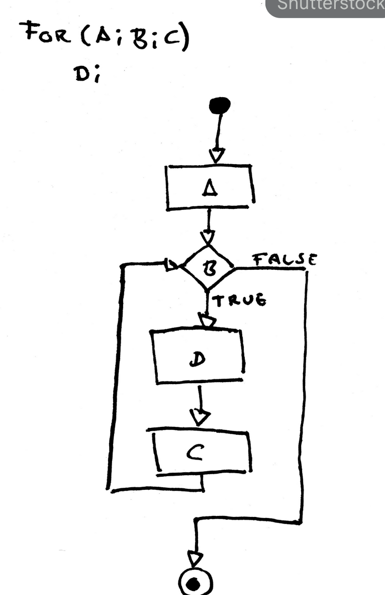

1. Поиск через рекурсию и проверка каждой ветки или листа приведет к переполнению памяти. Такой подход забъет быстро память О(2n) - то есть на 20ой иттераций уже будет 1048576 записей.
2. Если мы применим правила деления чисел друг ну друга - то получится что 123 делится на 3 или на 1. НОД для 5 и 7 будет тоже 1( оба числа простые )
3. Я подумал что вместо того чтоб идти сверху вниз - мы пойдем обратно. Связь между А и Б ( 5 и 7 ) и числом C ( 123 ) наблюдается через теорему БАЗУ. Линейное уравнение которое показывает что c = ax + by - где x & y - целые числа, и говорит о том что число С можно получить комбинацией А и Б только тогда когда число С будет делиться без остатка на  НОД(А,Б). В нашем случае ветвления в итоге приведуд ко ВСЕМ ВОЗМОЖНЫМ ВАРИАНТАМ СЛОЖЕНИЯ ДВУХ ЧИСЕЛ. Остается только определить если можно получить число С из двух А + Б и найти НОД этих чисел.
4. Нахождения НОД(А,Б) делается через алгоритм Евклида для нахождения НОДа двух чисел. В это случае сложность вычисления падает до log(min(A,B))
5. Получается у нас в итоге 2 проверки первичные:
   a. C === A || C === B => YES
   b. C < A && C < B => NO 
6. Алгоритм Евклида:
   Алгоритм нахождения НОД делением
    Большее число делим на меньшее.
    Если делится без остатка, то меньшее число и есть НОД (следует выйти из цикла).
    Если есть остаток, то большее число заменяем на остаток от деления.
    Переходим к пункту 1.

7. В коде это выглядит как 
 const getGreaterCommonDivider = (x, y) => {
    while (y != 0n) {
      x %= y;
      [x, y] = [y, x];
    }
    return x;
  };

8. Завершающий этап деление без остатка С на НОД(А.Б) - если остаток имеется - НЕТ - если остаток равен 0 = тогда ДА

Блок Схема + Решение не листе

